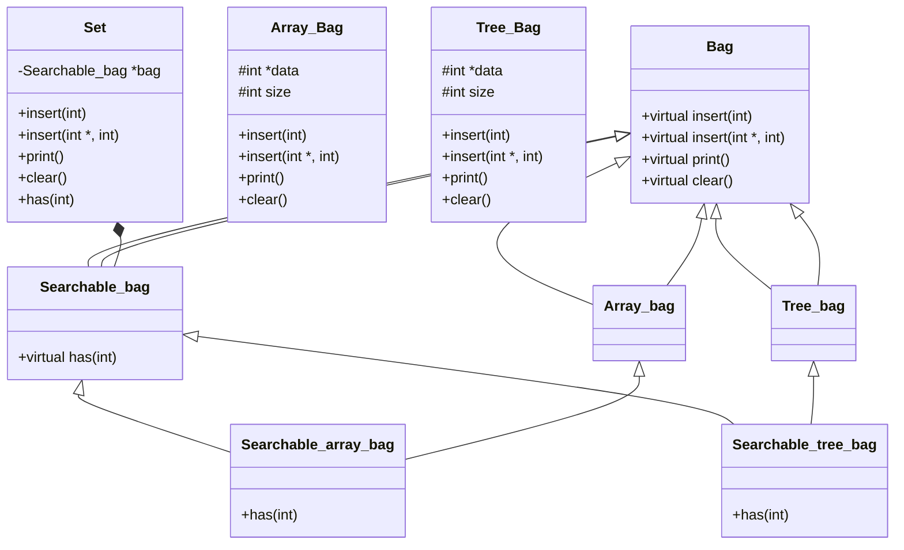

# Considerations about Poly

## Remove compilation errors.

### 1.- In all files:
Replace "nullptr" by NULL

### 2.- In main:
Use Dynamic_cast instead of static_cast.
Variable tmp declaration as a reference.
Declare int intems_to_insert[] = {1,2,3,4}


## Define headers.
searchable bags inherit from two clases.



```c++
class searchable_tree_bag : public tree_bag, public searchable_bag {};
class searchable_array_bag : public array_bag, public searchable_bag {};
```

Both classes implement only one member: `bool has(int) const`.
Use tree::insert as inspiration to implement has(int) in the class 
searchable_tree_bag.

## Create set class 
Create a canonical `set` class as a `COMPOSITION` that `has-a` class 
instead of the regular `INHERITANCE` class that `is-a` class.

Set has a private searchable bag.

```c++
class set
{
	private:
	searchable_bag *bag;
};
```
All set`s methods use `bag->method()`.
Set`s insert methods only insert when `has()` returns false.

